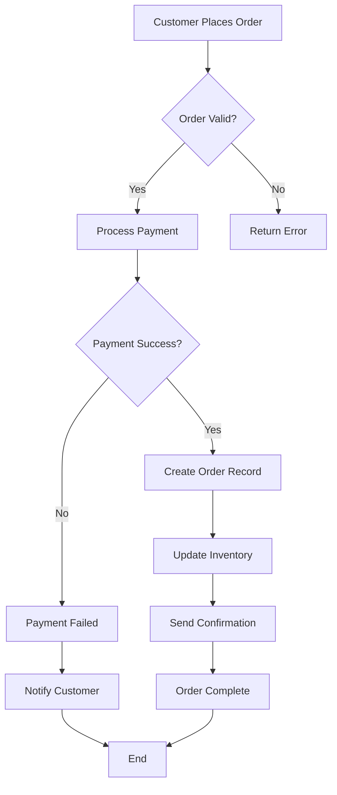
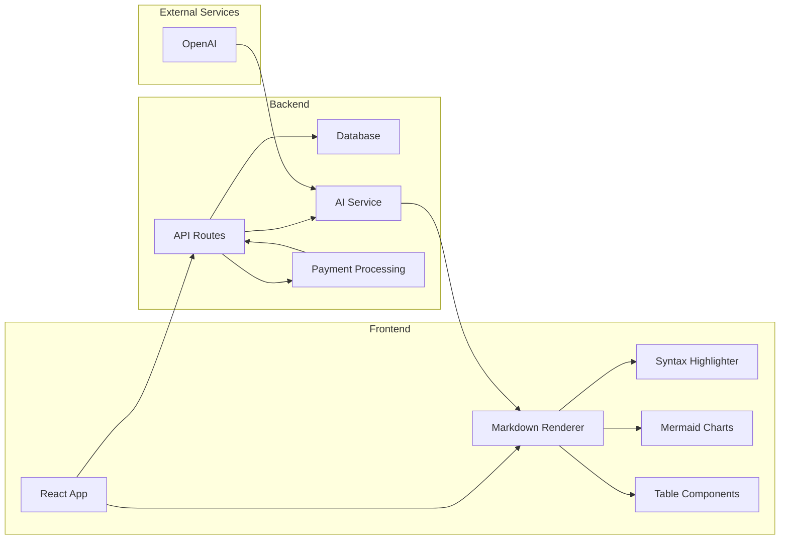
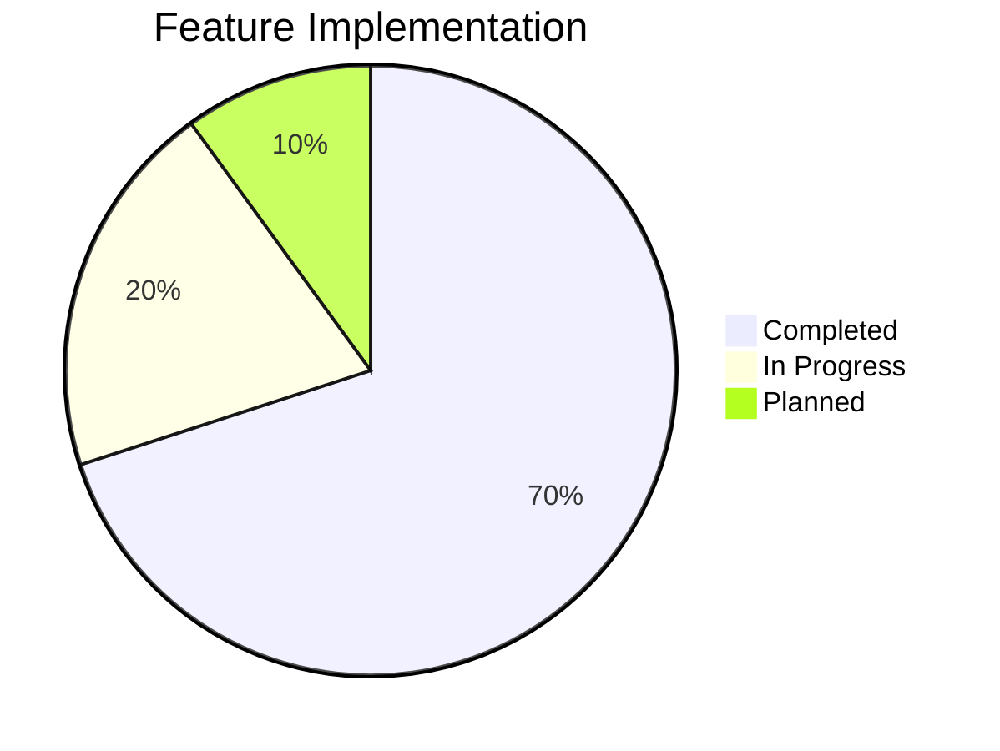

# Enhanced Markdown Capabilities Test

## 🚀 OMS Chat Markdown Features

This document demonstrates the enhanced markdown capabilities in the OMS Chat application, featuring syntax highlighting, Mermaid diagrams, and beautiful styling that matches the purple theme.

## 📊 Sample Data Table

| Feature | Status | Priority | Implementation |
|---------|--------|----------|----------------|
| Syntax Highlighting | ✅ Complete | High | highlight.js |
| Mermaid Diagrams | ✅ Complete | High | mermaid.js |
| Table Styling | ✅ Complete | Medium | Custom CSS |
| Code Copy Button | ✅ Complete | Medium | Clipboard API |
| Theme Integration | ✅ Complete | High | Tailwind CSS |

## 🔄 Order Management System Flow



## 🏗️ System Architecture



## 💻 Code Examples

Here's a sample order processing function:

```javascript
async function processOrder(orderData) {
    try {
        // Validate order data
        const validation = await validateOrder(orderData);
        if (!validation.isValid) {
            throw new Error(validation.errors.join(', '));
        }

        // Process payment
        const paymentResult = await processPayment({
            amount: orderData.total,
            currency: 'USD',
            paymentMethodId: orderData.paymentMethodId
        });

        if (paymentResult.status === 'succeeded') {
            // Create order record
            const order = await createOrder({
                ...orderData,
                paymentIntentId: paymentResult.id,
                status: 'confirmed'
            });

            // Update inventory
            await updateInventory(orderData.items);

            return { success: true, orderId: order.id };
        } else {
            throw new Error('Payment failed');
        }
    } catch (error) {
        console.error('Order processing error:', error);
        return { success: false, error: error.message };
    }
}
```

## 📈 Performance Metrics

| Metric | Current | Target | Improvement |
|--------|---------|--------|-------------|
| Page Load Time | 2.3s | 1.5s | 35% faster |
| Time to Interactive | 3.1s | 2.0s | 35% faster |
| Bundle Size | 1.2MB | 800KB | 33% smaller |
| Lighthouse Score | 85 | 95+ | +10 points |

## 🎯 Feature Implementation Status



## 🔧 Configuration Example

```yaml
# OMS Configuration
database:
  host: localhost
  port: 5432
  name: oms_production
  ssl: true

payment:
  currency: USD
  tax_rate: 0.08

features:
  markdown_rendering: true
  mermaid_diagrams: true
  syntax_highlighting: true
  dark_mode: true
```

## 📝 Text Formatting Examples

This paragraph demonstrates various **text formatting** options:

- **Bold text** for emphasis
- *Italic text* for subtle emphasis
- `Inline code` for technical terms
- [Links](https://example.com) for external resources

> This is a blockquote that provides additional context or highlights important information. It uses the purple accent color to match the theme.

### Lists and Organization

1. **Order Processing Steps**
   - Validate customer information
   - Check inventory availability
   - Process payment
   - Create order record
   - Send confirmation email

2. **Error Handling**
   - Log errors to monitoring system
   - Notify customer of issues
   - Retry failed operations
   - Escalate critical failures

## 🎨 Theme Integration

The markdown renderer seamlessly integrates with the OMS Chat theme:

- **Primary Color**: Purple (`#7C3AED`) for accents and highlights
- **Background**: Dark blue-gray (`#1A1A2E`) for main background
- **Cards**: Dark purple-gray (`#2C2C4A`) for content areas
- **Text**: High contrast white for readability
- **Borders**: Subtle purple-gray for separation

## ✨ Interactive Features

- **Copy Code**: Hover over code blocks to reveal copy button
- **Syntax Highlighting**: Automatic language detection and coloring
- **Responsive Tables**: Horizontal scroll on mobile devices
- **Mermaid Diagrams**: Interactive and animated flowcharts
- **Dark Mode**: Automatic theme switching support

This enhanced markdown system provides a rich, interactive experience for displaying technical documentation, system diagrams, and formatted content within the OMS Chat application.


